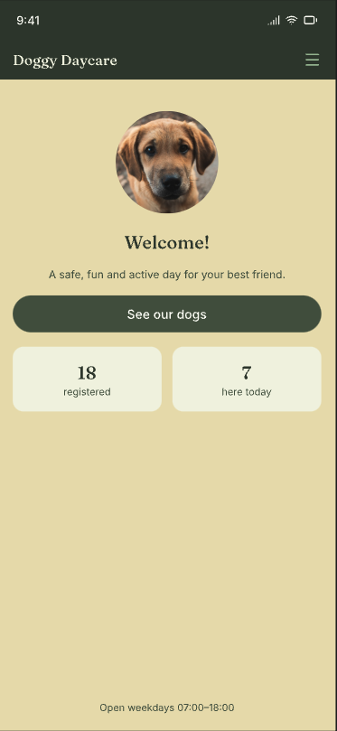
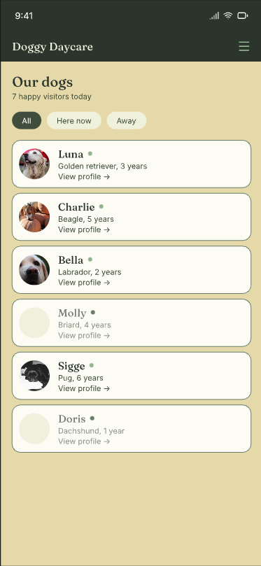
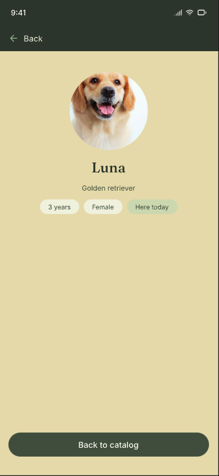
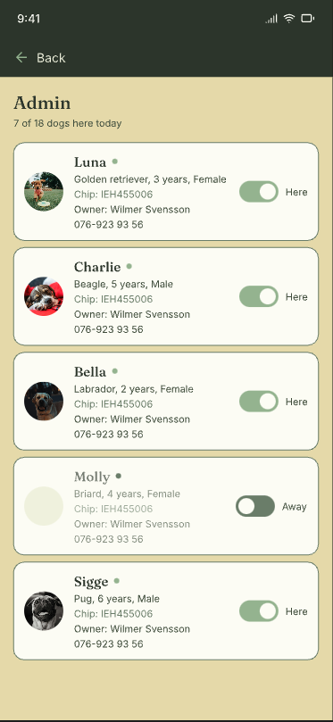

# Holette D Dogsout

A React web app for a dog daycare that keeps track of the dogs visiting them — which dogs are registered, which ones are here today, and who to call about each one.

Live site: <https://patriknoordh.github.io/holette-D-dogsout/>

https://github.com/user-attachments/assets/955b186b-23ed-4b5b-8e81-fcbb44c97fdf

## Table of Contents
- [UX](#ux)
  - [App Purpose](#app-purpose)
  - [App Goal](#app-goal)
  - [Developer Goals](#developer-goals)
  - [User Goals](#user-goals)
  - [Audience](#audience)
  - [Communication](#communication)
- [Agile Planning](#agile-planning)
  - [Tickets](#tickets)
  - [Implemented Tickets](#implemented-tickets)
  - [Not Implemented Tickets](#not-implemented-tickets)
  - [Git Workflow](#git-workflow)
- [Design](#design)
  - [Prototype](#prototype)
  - [Colour Scheme](#colour-scheme)
  - [Fonts](#fonts)
- [Features](#features)
  - [Existing Features](#existing-features)
  - [Future Features](#future-features)
- [Testing](#testing)
  - [Manual Testing](#manual-testing)
  - [Bugs](#bugs)
  - [Unfixed Bugs](#unfixed-bugs)
- [Technologies](#technologies)
  - [Main Languages Used](#main-languages-used)
  - [Architecture](#architecture)
  - [Data](#data)
  - [Setup & Installation](#setup--installation)
- [Credits](#credits)

## UX

### App Purpose

Holette D Dogsout is a web app for a dog daycare. It shows every registered dog, whether each one is at the daycare or at home today, and lets staff check dogs in and out and look up the owner's contact details.

The public part of the app is for dog owners and visitors: a home page with today's numbers, a catalog of all dogs with a "here today / at home" filter, and a detail page per dog. The admin part is for staff: owner details, chip numbers, and a presence switch per dog.

### App Goal

- Show all dogs from the daycare's register in a clear, browsable catalog
- Make it obvious at a glance which dogs are present today
- Let staff toggle a dog's presence and see owner contact details
- Work well on a phone first, and scale up to a desktop layout
- Be available in English and Swedish

### Developer Goals

This is a five-day school group project. Beyond the app itself, the goals were:

- Build a layered React architecture with one-way data flow: `api → hook → page → component`
- Understand navigation before reaching for a router — page state lives in `App.jsx`, no routing library
- Handle all four data states (loading / error / empty / success) on every screen
- Use a shared design-token system so four people produce one visual language
- Manage all work through GitHub issues, feature branches, pull requests and reviews
- Keep personal data (owner details, chip numbers) out of the public UI by design

### User Goals

Dog owners and visitors want to:
- See which dogs are at the daycare today
- Browse and find a specific dog quickly
- Read a dog's profile — breed, age, sex, presence

Daycare staff want to:
- Check a dog in or out with one tap
- Find an owner's phone number without leaving the app
- See the chip number when a dog needs identifying

### Audience

Primarily the daycare's staff and the dog owners who use it. Secondarily anyone visiting the daycare's site who wants to see the dogs.

### Communication

The app uses a warm sand background with dark forest-green surfaces and sage-green accents — calm and natural rather than clinical. Headings and dog names are set in a serif face to feel friendly; body text is the system sans-serif for legibility. Cards, chips and buttons use soft rounded shapes.

[Back to top](#holette-d-dogsout)

## Agile Planning

All work was split into tickets with the prefix `HDD-NNN`, each tracked as a GitHub issue with a layer, a file list and acceptance criteria. Tickets were built in dependency order — API layer first, then the hook, then pages and components — so that each layer had real data to build against.

### Tickets

Tickets are grouped by the layer they touch. Click a title to open the issue.

#### Foundation
- [HDD-001 · Design tokens and global styles](https://github.com/PatrikNoordh/holette-D-dogsout/issues/2)
- [HDD-002 · App shell with page state navigation](https://github.com/PatrikNoordh/holette-D-dogsout/issues/3)
- [HDD-003 · Header component](https://github.com/PatrikNoordh/holette-D-dogsout/issues/4)

#### Data
- [HDD-004 · API layer — fetch and normalize dogs](https://github.com/PatrikNoordh/holette-D-dogsout/issues/5)
- [HDD-005 · useDogs hook](https://github.com/PatrikNoordh/holette-D-dogsout/issues/6)
- [HDD-012 · Presence overrides in localStorage](https://github.com/PatrikNoordh/holette-D-dogsout/issues/22)
- [HDD-015 · Fetch dogs once in App and pass down as props](https://github.com/PatrikNoordh/holette-D-dogsout/issues/30)

#### Screens
- [HDD-006 · Home page](https://github.com/PatrikNoordh/holette-D-dogsout/issues/7)
- [HDD-007 · DogCard component](https://github.com/PatrikNoordh/holette-D-dogsout/issues/8)
- [HDD-008 · Catalog page with filter chips](https://github.com/PatrikNoordh/holette-D-dogsout/issues/9)
- [HDD-009 · DogDetail page](https://github.com/PatrikNoordh/holette-D-dogsout/issues/10)
- [HDD-013 · Admin page with owner details and presence switch](https://github.com/PatrikNoordh/holette-D-dogsout/issues/23)
- [HDD-014 · English / Swedish UI strings with a language switch](https://github.com/PatrikNoordh/holette-D-dogsout/issues/24)

#### Project
- [HDD-010 · README with group conventions](https://github.com/PatrikNoordh/holette-D-dogsout/issues/11)
- [HDD-011 · GitHub Pages deployment](https://github.com/PatrikNoordh/holette-D-dogsout/issues/12)

### Implemented Tickets

<!-- TODO: update the count when HDD-010/011/014 are merged -->
12 of 15 tickets are implemented and merged into `dev`.

<details>
<summary>Show implemented tickets</summary>

- [HDD-001 · Design tokens and global styles](https://github.com/PatrikNoordh/holette-D-dogsout/issues/2)
- [HDD-002 · App shell with page state navigation](https://github.com/PatrikNoordh/holette-D-dogsout/issues/3)
- [HDD-003 · Header component](https://github.com/PatrikNoordh/holette-D-dogsout/issues/4)
- [HDD-004 · API layer — fetch and normalize dogs](https://github.com/PatrikNoordh/holette-D-dogsout/issues/5)
- [HDD-005 · useDogs hook](https://github.com/PatrikNoordh/holette-D-dogsout/issues/6)
- [HDD-006 · Home page](https://github.com/PatrikNoordh/holette-D-dogsout/issues/7)
- [HDD-007 · DogCard component](https://github.com/PatrikNoordh/holette-D-dogsout/issues/8)
- [HDD-008 · Catalog page with filter chips](https://github.com/PatrikNoordh/holette-D-dogsout/issues/9)
- [HDD-009 · DogDetail page](https://github.com/PatrikNoordh/holette-D-dogsout/issues/10)
- [HDD-012 · Presence overrides in localStorage](https://github.com/PatrikNoordh/holette-D-dogsout/issues/22)
- [HDD-013 · Admin page with owner details and presence switch](https://github.com/PatrikNoordh/holette-D-dogsout/issues/23)
- [HDD-015 · Fetch dogs once in App and pass down as props](https://github.com/PatrikNoordh/holette-D-dogsout/issues/30)

</details>

### Not Implemented Tickets

<!-- TODO: move to Implemented as they merge -->
- [HDD-010 · README with group conventions](https://github.com/PatrikNoordh/holette-D-dogsout/issues/11) — this document, in progress
- [HDD-011 · GitHub Pages deployment](https://github.com/PatrikNoordh/holette-D-dogsout/issues/12) — in progress
- [HDD-014 · English / Swedish UI strings with a language switch](https://github.com/PatrikNoordh/holette-D-dogsout/issues/24) — in review

### Git Workflow

```
feat/HDD-005-use-dogs-hook  →  dev  →  main  →  GitHub Pages
```

- **One ticket, one branch, one PR.** Branches are named `type/HDD-NNN-short-description`
- **Commits** follow `type [HDD-NNN] Present tense description`, e.g. `feat [HDD-005] Add useDogs hook`
- **Types:** `feat` · `fix` · `style` · `refactor` · `chore` · `docs`
- **PRs target `dev`**, are reviewed by another group member, and never merged by their author
- **`dev` merges to `main`** when the group agrees the state is deployable; the live site is built from `main`
- **Stage files by name** — never `git add .`
- **Shared files** (`App.jsx`, `main.jsx`, `tokens.css`, `vite.config.js`, `package.json`) are called out in the PR description when touched, since they're where four branches collide

[Back to top](#holette-d-dogsout)

## Design

### Prototype

The app was designed in [Pencil](https://pen.dev) before development began — mobile screens first, with desktop and tablet variants. The prototype is intentionally basic: it fixed the layout, palette, typography and the four screens, and served as the shared reference while four people built in parallel.

The final app differs from it in several places — the Home page gained a video carousel, the Catalog uses a Swiper grid, the header has a hamburger menu and a language switch, and the Admin page shows breed, age and sex on separate lines. The prototype should be read as the starting point, not a spec of the current app.

| Home | Catalog | Dog detail | Admin |
|:---:|:---:|:---:|:---:|
|  |  |  |  |

### Colour Scheme

All colours are CSS custom properties in `src/styles/tokens.css`. No component stylesheet contains a raw hex value.

- **Sand** `#E8DFA8` — Page background
- **Surface** `#FCFCF5` — Cards, panels
- **Forest green** `#2E3A2E` — Header, primary buttons, active chips
- **Cream** `#F3F1E4` — Text on green surfaces
- **Sage** `#8DB58A` — Presence dot, "here today" chip, switch on-state
- **Text** `#26302A` — Body text and headings
- **Muted** `#8C9189` — Dogs that are away, secondary text
- **Border** `#D9DCCB` — Card outlines

### Fonts

- **Headings and dog names** — Georgia (serif), via `--font-heading`
- **Body** — the system sans-serif stack (`system-ui`, Segoe UI, Roboto), via `--font-body`

No web fonts are loaded; the system fonts keep the first paint fast and avoid layout shift.

[Back to top](#holette-d-dogsout)

## Features

### Existing Features

- **Home** — welcome hero with video carousel, live counts of registered dogs and dogs here today, and a link into the catalog
- **Catalog** — every dog as a card with photo, name, breed, age and presence dot. Filter chips: All dogs / Here today / At home. Responsive grid via Swiper
- **Dog detail** — large photo, name, breed, and chips for age, sex and presence. Falls back to a placeholder image when a photo is missing or broken
- **Admin** — staff view listing every dog with owner name, phone (tap-to-call), chip number and a Here/Away switch. Present dogs sort first, then alphabetically
- **Check-in / check-out** — the presence switch persists per device in `localStorage` and is reflected on Home, Catalog and Dog detail immediately
- **Language switch** — every UI string lives in `src/strings/en.js` and `sv.js`; a button in the header flips the whole app between English and Swedish, and the choice survives refresh
- **Four states everywhere** — every screen handles loading, error (with retry), empty and success
- **Single fetch per session** — dogs are fetched once in `App.jsx` and passed to every page as props
- **Responsive** — mobile-first layout, expanding to a multi-column desktop grid
- **Accessible** — visible keyboard focus, `role="switch"` + `aria-checked` on toggles, `aria-current` on nav, `alt` text on every dog photo, reduced-motion respected

### Future Features

- **Admin authentication** — the admin page currently has no login. It shows owner contact details, so a real deployment would gate it behind authentication
- **Shared presence state** — check-ins are stored per device. A backend would let two front-desk devices see the same state
- **Deep links** — there is no URL per screen, so a dog can't be bookmarked. A small hash-based router would restore this without a library
- **Search** — the design has a search icon in the header that isn't wired up

[Back to top](#holette-d-dogsout)

## Testing

### Manual Testing

| Feature Area | Description | Status |
|:---|:---|:---:|
| **Home** | Counts match the API; "See our dogs" opens the catalog; Admin button visible on Home only | ✅ |
| **Catalog** | All 78 dogs load; filter chips show the right subset and the right empty message; card click opens the correct dog | ✅ |
| **Dog detail** | Correct dog by chip number; chips reflect age, sex and presence; unknown chip shows "Dog not found."; broken photo shows placeholder | ✅ |
| **Admin** | Owner name, phone link and chip number per dog; present-first sort; switch toggles instantly | ✅ |
| **Presence persistence** | Toggle survives refresh; removing `hdd:presence` returns to API values; corrupt value is ignored | ✅ |
| **Single fetch** | One request to jsonbin per session regardless of navigation; Try again triggers a new one | ✅ |
| **Loading state** | Slow 3G shows loading text on every page | ✅ |
| **Error state** | Offline shows error + Try again on every page; retry recovers | ✅ |
| **Language switch** | Every string flips on every page; choice persists; invalid stored value falls back to English | ✅ |
| **Keyboard** | All buttons and switches reachable by Tab, activated by Enter/Space, with a visible focus ring | ✅ |
| **Mobile (375px)** | No horizontal scroll on any page; hamburger menu holds nav and language switch | ✅ |
| **Desktop** | Catalog and Admin lay out in multi-column grids; header shows inline nav | ✅ |
| **Production build** | `npm run build` passes; assets resolve under `/holette-D-dogsout/` | ✅ |

### Bugs

- **Broken dog photos showed a browser broken-image icon** ([#27](https://github.com/PatrikNoordh/holette-D-dogsout/pull/27), [#34](https://github.com/PatrikNoordh/holette-D-dogsout/pull/34), [#36](https://github.com/PatrikNoordh/holette-D-dogsout/pull/36)) — Fixed with an `onError` fallback to a placeholder image in DogCard, DogDetail and AdminRow.
- **Header logo 404'd on GitHub Pages** ([#38](https://github.com/PatrikNoordh/holette-D-dogsout/pull/38)) — Fixed by prefixing the path with `import.meta.env.BASE_URL`.
- **Admin cards had uneven heights and widths** ([#36](https://github.com/PatrikNoordh/holette-D-dogsout/pull/36)) — Fixed by letting the card fill its grid cell and splitting breed from age/sex.
- **Each page re-fetched the dogs on mount** ([#39](https://github.com/PatrikNoordh/holette-D-dogsout/pull/39)) — Fixed by moving the single `useDogs()` call to `App.jsx`.
- **Admin PR merged into the wrong base** ([#32](https://github.com/PatrikNoordh/holette-D-dogsout/pull/32)) — A stacked PR was merged before its base. Fixed with a follow-up PR carrying the commits to `dev`. Lesson: stacked PRs merge bottom-up.

### Unfixed Bugs

- Navigating away from Home while a carousel video is playing logs a harmless `AbortError: The play() request was interrupted` in the console. No user-facing effect.

[Back to top](#holette-d-dogsout)

## Technologies

### Main Languages Used

- **JavaScript (ES2022)** with **JSX** — all application logic and UI. No TypeScript
- **CSS** — CSS Modules per component, design tokens as custom properties. No Tailwind, no CSS-in-JS
- **React 19** — function components and hooks only
- **Vite** — dev server and production build
- **Swiper** — carousel on Home and the responsive card grid in Catalog

### Architecture

The app is layered, and data flows one way:

```
Page → Hook → API module → fetch() → jsonbin
```

```
src/
├── main.jsx                      # entry — global CSS + LanguageProvider
├── App.jsx                       # page state, navigate(), single useDogs() call
├── api/
│   └── dogs.js                   # fetch + unwrap `record` + normalize. No React.
├── hooks/
│   ├── useDogs.js                # loading / error / data + presence merge
│   └── usePresence.js            # localStorage overrides keyed by chipNumber
├── strings/
│   ├── en.js                     # all English UI copy
│   ├── sv.js                     # same keys, Swedish
│   └── LanguageContext.jsx       # LanguageProvider + useStrings()
├── pages/
│   ├── Home/
│   ├── Catalog/
│   ├── DogDetail/
│   └── Admin/                    # Admin.jsx + page-local AdminRow.jsx
├── components/
│   ├── Header/
│   └── DogCard/
└── styles/
    ├── tokens.css                # single source of truth for colour, spacing, radius, fonts
    └── global.css                # reset + base element styles
```

**Key architectural decisions:**

- **No routing library.** `App.jsx` holds `page` and `selectedChip` in state and passes a `navigate(to, chip)` function down as `onNavigate`. The group wanted to understand navigation before adding a router; on four screens a router isn't load-bearing. Trade-off: no URL per screen.
- **Pages navigate, components report.** Pages receive `onNavigate`. Presentational components never do — they emit a domain callback (`onSelect(chipNumber)`, `onToggle(chipNumber)`) and the page translates it. This keeps `DogCard` and `AdminRow` reusable.
- **One fetch, props down.** `useDogs()` is called once in `App.jsx`; every page gets `dogs`, `isLoading`, `error`, `onRetry` as props. Toggling presence in Admin re-renders `App`, so every page sees it.
- **Normalize at the boundary.** `api/dogs.js` is the only file that knows the API's shape. Every dog leaving it has every field, with safe defaults — pages never guard.
- **Presence is a local override layer.** The API is read-only, so check-ins are a `{ [chipNumber]: boolean }` map in `localStorage`, merged into `dog.present` inside `useDogs`.
- **Owner and chip number are never rendered publicly.** They stay in the data for the Admin page, which is the one deliberate exception.
- **Strings via Context.** `useStrings()` returns `{ t, lang, setLang }`; components read `t.screen.key`. Strings needing a value are functions (`t.catalog.visitors(n)`) so each language owns its own sentence.
- **Page-local components.** A component used by exactly one page lives in that page's folder (`Admin/AdminRow.jsx`). It's promoted to `src/components/` only when a second page needs it.

### Data

Dogs come from a read-only JSON endpoint:

```
https://api.jsonbin.io/v3/b/68ccf99ad0ea881f4082d5b8
```

The array is nested under `record`. Each dog has `name`, `sex`, `breed`, `img`, `present`, `age`, `chipNumber` and a nested `owner` with `name`, `lastName`, `phoneNumber`. There is no `id` — `chipNumber` is the unique key. Nothing is written back to the API.

### Setup & Installation

1. Clone the repository: `git clone https://github.com/PatrikNoordh/holette-D-dogsout.git`
2. `cd holette-D-dogsout`
3. `npm install`
4. `npm run dev` and open `http://localhost:5173/holette-D-dogsout/` — note the path: Vite's `base` is set for GitHub Pages, so the app is served under `/holette-D-dogsout/` in dev too
5. `npm run build` for a production build in `dist/`

Requires Node 18 or later.

[Back to top](#holette-d-dogsout)

## Credits

### Content

All application logic, UI and design were created by:

- [PatrikNoordh](https://github.com/PatrikNoordh)
- [Shallange](https://github.com/Shallange)
- [Robbaeli](https://github.com/Robbaeli)
- [mikaeldramatic-ui](https://github.com/mikaeldramatic-ui)

### Media

- **Dog photos** — served by the [Dog CEO API](https://dog.ceo/dog-api/) via the project's data endpoint
- **Design & prototype** — [Pencil](https://pen.dev)
- **Carousel** — [Swiper](https://swiperjs.com/)
- **Videos** — Generated with [Google Gemini](https://gemini.google.com/) (Veo)
